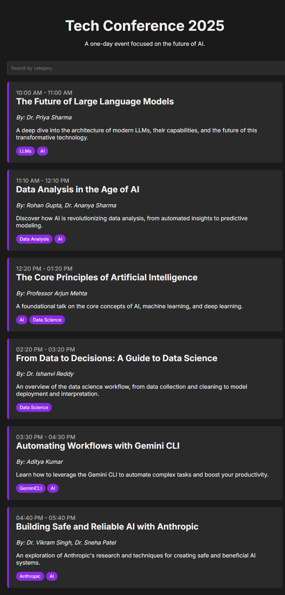

# Tech Event Talks Web

This is a web application for managing and displaying tech event talks.

## Screenshot



## Installation

1. Clone the repository:
   ```bash
   git clone https://github.com/Siddappag/repository-event-talks-web.git
   ```
2. Install the dependencies:
   ```bash
   npm install
   ```

## Usage

To start the server, run the following command:

```bash
npm start
```

The server will start on port 3000. You can access the application at [http://localhost:3000](http://localhost:3000).

## Project Structure

- `server.js`: The main server file.
- `talks.json`: A JSON file containing the talk data.
- `public/`: The public directory containing the frontend files.
  - `index.html`: The main HTML file.
  - `script.js`: The main JavaScript file.
  - `style.css`: The main CSS file.